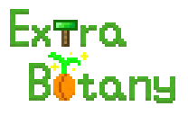
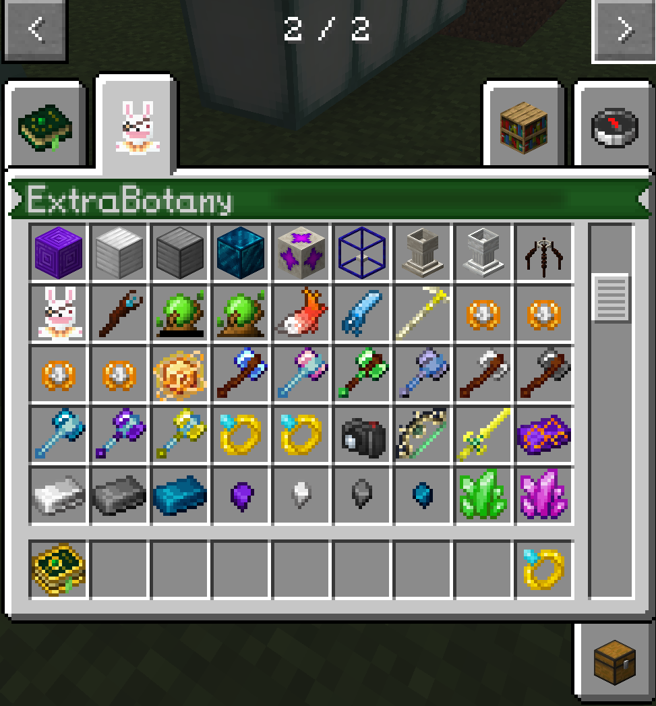
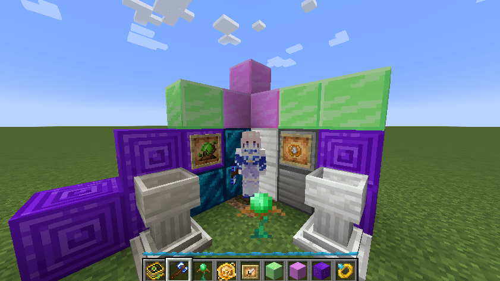

# ExtraBotany: Reburn
[](https://crowdin.com/project/extrabotany)

Popular botania addon comes back on 1.20.1!

For higher minecraft version.

This is a completely new botania addon.




## What's New?

### Textures

Almost all textures has been rewritten!

Even more vanilla.

### Flowers

- Tradeorchid: Grants discounted trades for nearby villagers within a certain range.
- Woodienia: Uses mana to chop down a large area of logs.
- Reikarlily: Harnesses the power of lightning to generate mana.

### Useful Items
- Mana Charger: No more worries about leaving your items in the mana pool.
- Master Band of Mana: A greater mana ring with massive capacity — up to `Long.MAX`.
- Excalibur: Shoot a mana burst that can track mobs.
- VoidArchives: Simulate other relics.
- And more Relics...

### Boss
- Guardian of Gaia III
- Herrscher of The Void(WIP)

**And you can play Extrabotany both on `Forge` or `Fabric`.**

## KubeJS

You can use KubeJS to add your custom recipes.

Find more [here](web/kubejs_en.md).

## Maven
For developers, here is a simple tutorial on developing with Extrabotany.

Since Extrabotany is a multi-platform project, you may only need to develop an addon for the Forge side. Therefore, the following tutorial is specifically designed for Forge.

Here is an example of depending on Extrabotany on the Forge side. Add the following to your `build.gradle`:

```groovy
repositories {
    maven {
        name = "lounode" //Extrabotany
        url = "https://maven.lounode.top/releases"
    }
}

dependencies {
    compileOnly fg.deobf("io.github.lounode.extrabotany:extrabotany-forge:[VERSION]")
    runtimeOnly fg.deobf("io.github.lounode.extrabotany:extrabotany-forge:[VERSION]")
}
```
You can find the version number to fill in [here](https://maven.lounode.top/#/releases/io/github/lounode/extrabotany/extrabotany-forge).
